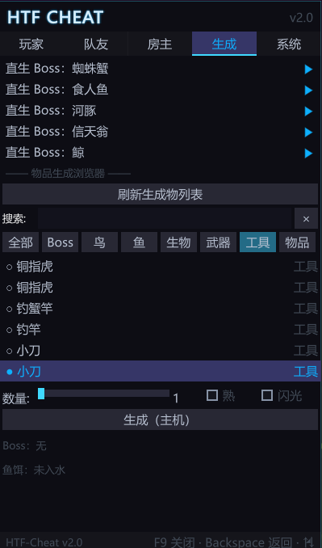
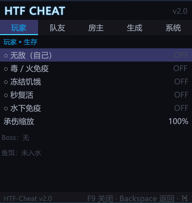
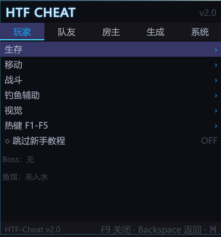
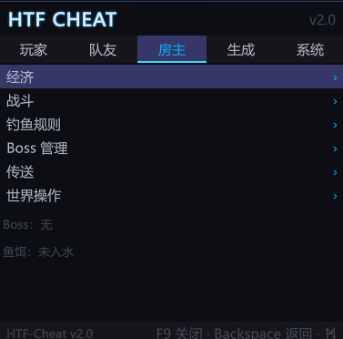
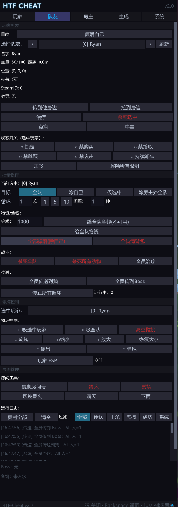

# HTF Injector — 你的「How to Fish」游戏Mod指南

你以为游戏Mod只是简单修改？其实，它是一门艺术。  
这是一把为「How to Fish」游戏量身打造的注入器，让你轻松掌控游戏的一切——从玩家生存到队友协作，从房间管理到物品生成，尽在掌握。

## 功能亮点

### 玩家模式（生存/移动/战斗/钓鱼辅助/视觉）
- **生存强化**：无敌、毒/火免疫、冻结饥饿、秒复活、水下免疫、承伤缩放
- **移动辅助**：自定义移动参数
- **战斗增强**：提升战斗能力
- **钓鱼辅助**：优化钓鱼体验
- **视觉调整**：ESP、视觉增强等功能

### 队友协作（玩家列表/单体操作/批量控制/物理恶搞）
- **玩家列表**：实时显示队友血量、位置、距离、持有物和 SteamID
- **单体操作**：传送到队友身边、拉到身边、治疗、点燃、中毒等
- **状态控制**：锁定、禁购买、禁拾取、禁跳跃、禁攻击、持续卸装、击飞
- **批量操作**：全队治疗、全队传送、全队掉落、给全队物资
- **物理恶搞**：吸人、高空抛投、旋转、缩小/放大、倒吊、弹球
- **玩家ESP**：显示最近16个玩家位置

### 房主管理（经济/战斗/钓鱼规则/Boss管理/传送/世界操作）
- **经济控制**：卖价调整、金钱操作、赌场偏置、赌注保险、轮盘物理引导
- **皮肤机必出**：指定下次老虎机会出的皮肤
- **手持物品编辑**：售价、重量系数、熟度、赌注倍率、复制手持物
- **战斗管理**：调整战斗相关参数
- **钓鱼规则**：自定义钓鱼规则
- **Boss管理**：管理游戏Boss
- **传送功能**：快速传送
- **世界操作**：调整游戏世界参数

### 物品生成（Boss生成/物品浏览器/分类搜索）
- **Boss生成**：一键生成蜘蛛蟹、食人鱼、河豚、信天翁、鲸等Boss
- **物品浏览器**：按分类浏览所有物品（全部、Boss、鸟、鱼、生物、武器、工具、物品）
- **搜索功能**：快速搜索特定物品
- **生成设置**：自定义数量、熟练度、闪光等参数

### 系统设置
- **热键配置**：F1-F5自定义热键
- **新手教程跳过**：一键跳过新手教程
- **运行日志**：实时显示操作记录，支持分类过滤

## 安装与使用

1. **下载**：从本仓库下载最新版本。
2. **运行**：双击 `HTFPanel.exe` 启动辅助工具。
3. **启动游戏**：进入「How to Fish」游戏。
4. **注入**：返回辅助工具，点击注入按钮。
5. **打开菜单**：按 F9 键打开Mod菜单，切换不同页签开始操作。

## 功能预览

### 玩家模式界面

*生存强化、移动辅助、战斗增强、钓鱼辅助、视觉调整*

### 队友协作界面

*玩家列表、单体操作、批量控制、物理恶搞*

### 房主管理界面

*经济控制、皮肤机必出、手持物品编辑*

### 物品生成界面

*Boss生成、物品浏览器、分类搜索*

### 系统设置界面

*热键配置、新手教程跳过、运行日志*

## 注意事项

- **主机权限**：修改他人状态的操作需要主机权限；非主机时按钮置灰。
- **反射兜底**：禁止购买/拾取/跳跃/攻击补丁使用动态方法名解析；目标缺失时该功能跳过。
- **给金钱**：MoneyManager 仅暴露本地玩家通道，无法给指定玩家/全队真实到账；按钮已标注“不可用”。
- **房间密码/最大人数/昼夜天气/封禁**：FishNet 房间相关 API 未在源码中直接暴露，当前为实验性占位，实际游戏中可能无效。
- **玩家 ESP**：最多显示 16 个最近玩家，超出不画。
- **吸人/锁定/旋转等每帧恶搞**：仅在主机端执行（非主机静默跳过），节流 0.15s，位置类走 Server.TeleportPlayer 合法通道，避免 Steam 发送限流。

## 免责声明

本工具仅供学习与研究使用，不得用于商业用途。使用本工具造成的一切后果，由使用者自行承担。

## 致谢

感谢「How to Fish」游戏社区的支持，以及影视飓风风格的灵感。

---

好了，以上就是本期「HTF Injector」的全部内容。  
如果你喜欢的话，别忘了给我们点点小心心，记得关注我们，这会对我们有很大的帮助。  
那么我们下次再见。